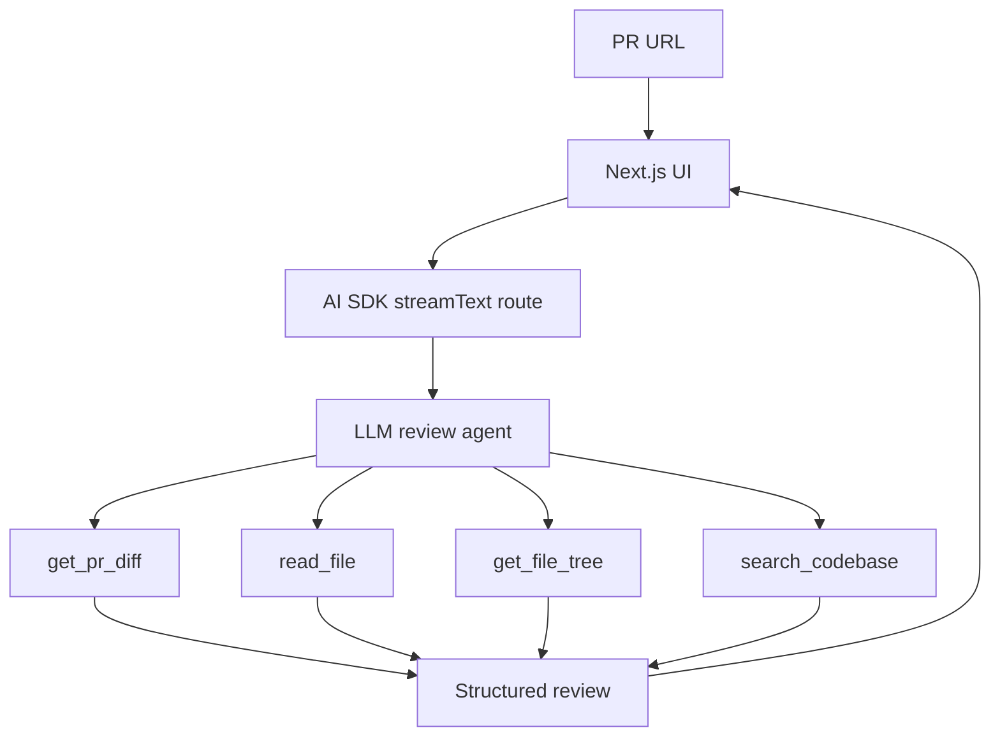

# Repo Pilot

Repo Pilot is a Next.js application that reviews GitHub pull requests with an agentic LLM loop. A user submits a PR URL, the model inspects the diff through tools, fetches additional repository context, searches for related patterns, and then streams a structured review.

The project is intentionally small: its purpose is to demonstrate an LLM deciding what to inspect next, calling tools, observing results, and continuing until it can produce a useful code review.

## Why This Exists

This project is built as portfolio evidence for Senior AI Platform Engineer work. It demonstrates:

- Agentic workflow design where the model plans tool use across multiple steps.
- Tool-using LLM orchestration with scoped GitHub capabilities.
- Full-stack AI platform engineering across Next.js, streaming APIs, typed tool contracts, and provider configuration.
- GitHub/API integration through a testable Octokit adapter.
- Streaming UX for observable agent execution, including tool traces and structured review output.
- A tool abstraction that can be extracted into an MCP capability layer.

## Agent Architecture

The review flow is implemented with the Vercel AI SDK:

1. The client sends a GitHub PR URL through `useChat`.
2. `src/app/api/chat/route.ts` extracts and validates the PR locator.
3. The route calls `streamText` with `stopWhen: stepCountIs(12)`.
4. The model receives four GitHub tools scoped to the requested repository and PR.
5. Tool calls stream back to the UI alongside the final review.

The system prompt requires the model to call `get_pr_diff` first, then use follow-up tools only when they add context.



## Tools

| Tool | Purpose |
| --- | --- |
| `get_pr_diff` | Fetch PR metadata and changed file patches. |
| `read_file` | Read a repository file, defaulting to the PR head commit. |
| `get_file_tree` | Inspect repository structure at the PR head commit. |
| `search_codebase` | Search for symbols, usages, and related patterns in the repo. |

The GitHub implementation is split into two layers:

- `src/lib/github/api.ts` wraps Octokit and GitHub response shapes.
- `src/lib/github/review-tools.ts` defines testable tool helpers and AI SDK tool definitions.

## Project Structure

```text
src/app/api/chat/route.ts          Streaming AI SDK endpoint
src/components/review-agent.tsx    PR input, tool progress, streamed review UI
src/lib/agent/review-request.ts    PR URL extraction and system prompt
src/lib/github/api.ts              Octokit-backed GitHub adapter
src/lib/github/pr-url.ts           GitHub PR URL parser
src/lib/github/review-tools.ts     Tool helpers and AI SDK tool definitions
```

## Local Development

Install dependencies:

```bash
npm install
```

Create `.env.local`:

```bash
AI_MODEL=anthropic/claude-sonnet-4.6
GITHUB_TOKEN=ghp_optional_for_higher_rate_limits
```

For model access, the intended production path is Vercel AI Gateway. Link a Vercel project, enable AI Gateway, then pull local environment variables:

```bash
vercel link
vercel env pull .env.local
```

Run the app:

```bash
vercel dev
```

`AI_MODEL` uses the Vercel AI Gateway model string format, for example `anthropic/claude-sonnet-4.6`. For the least surprising local runtime, use `vercel dev` so the Gateway/OIDC environment is available. Running `npm run dev` directly is only expected to work if your local shell already has valid AI Gateway credentials.

Open `http://localhost:3000` and paste a public GitHub pull request URL.

## Verification

```bash
npm test
npm run lint
npm run build
```

Current coverage focuses on:

- PR URL parsing and normalization.
- PR URL extraction from AI SDK UI messages.
- Review prompt requirements.
- Tool helper behavior without network calls.
- Octokit response mapping through fake adapters.

## Evaluation Strategy

The next production-readiness step is an offline eval harness with fixture PRs and expected findings. The harness should score:

- **Tool-call correctness:** Did the agent call `get_pr_diff` first, choose relevant files to read, and search for related patterns when needed?
- **Review quality:** Did suggestions include severity, confidence, evidence, reasoning, and a concrete recommendation?
- **False positive rate:** Did the agent flag issues unsupported by the diff or fetched context?
- **Missed critical issue rate:** Did it miss known correctness, security, or regression risks in the fixture PR?
- **Cost / latency per review:** How many model steps, tool calls, tokens, and seconds were required for each review?

Initial fixture set:

- Small UI-only PR with no serious findings expected.
- Backend logic PR with one intentional correctness issue.
- Auth or permission PR with one high-severity security issue.
- Refactor PR where related usage search is required to avoid a false positive.
- Large/generated-file PR that should exercise guardrails and truncation behavior.

## Design Decisions

- The tools are scoped per PR request, so the model cannot accidentally inspect another repository unless the user submits a different URL.
- `read_file` and `get_file_tree` default to the PR head SHA. This keeps follow-up tool calls simple for the model and avoids reviewing stale default-branch files.
- The adapter is injectable, which keeps unit tests deterministic and makes a future MCP extraction straightforward.
- The UI exposes an agent trace because the point of the project is to show the loop, not just the final markdown.
- Pull request metadata is cached per review toolset, so follow-up file and tree reads can reuse the PR head SHA fetched by `get_pr_diff`.

## Next Steps

- Add pagination for PRs with more than 100 changed files.
- Add optional GitHub App authentication for private repositories.
- Extract the GitHub tools into a TypeScript MCP server package.
